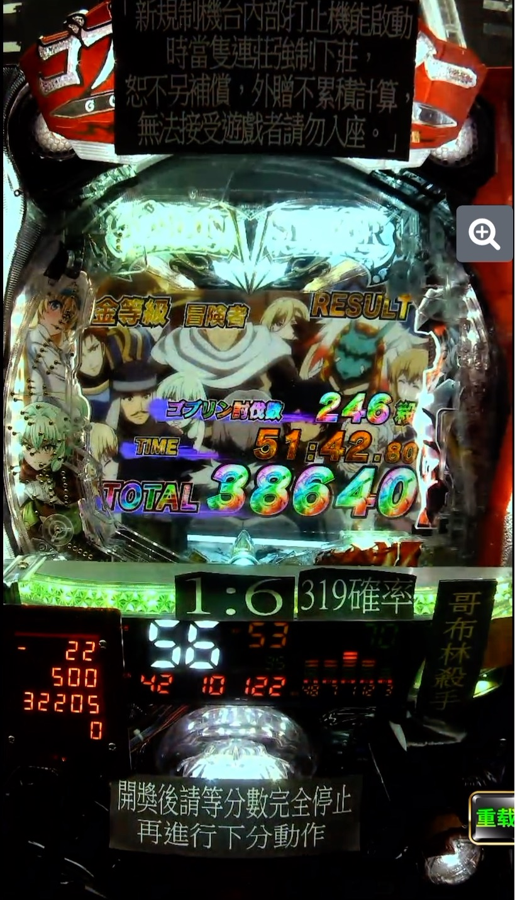

# Pゴブリンスレイヤー

| | |
|-|-|
| 大当り確率 | 1/319 |
| RUSH 突入率 | 60% |
| 継続率 | 約90％ |
| 出玉 | 約300 or 600 or 1500個 |
| 電サポ | 1 or 70回 |

[攻略](https://www.p-world.co.jp/machine/database/9811)

## Highest Score

## 